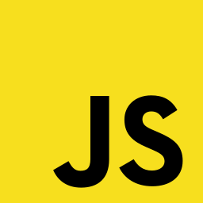

<p align="center">
    
    
    
</p>


# K11TechLab Playwright Automation (JavaScript)

A robust, real-world Playwright automation framework for **K11 Software Solutions**. This project demonstrates best practices in UI automation, advanced reporting, artifact management, and introduces cutting-edge AI-powered test generation for modern web applications.


## 🚀 Capabilities & Innovations

- **Playwright basic to advanced learning path:** Step-by-step demo tests and documentation guide you from Playwright fundamentals to advanced automation. Explore real-world scenarios on K11softwaresolutions.com, with code in the `tests/` directory and detailed articles in `/doc`.
- **AI-powered test generation:** Leverage OpenAI to automatically generate Playwright tests from prompt templates and config data, accelerating test authoring and coverage.
- **Context-aware flows:** Integrate XState for stateful, dynamic test scenarios and advanced automation logic.
- **Data-driven testing:** Use CSV, API, and DB config for parameterized, scalable test cases.
- **Secure config management:** `.env` and `.env.example` for safe API key handling and sharing.
- **Comprehensive demo suite:** Basic to advanced Playwright tests on real-world K11softwaresolutions.com scenarios.
- **Component, E2E, and API testing:** Unified structure for UI, API, and component-level validation.
- **Advanced reporting:** Allure, HTML, and video artifacts for rich evidence and debugging.
- **CI/CD ready:** Scalable, maintainable structure for enterprise automation.

Explore the `README-ai.md` for details on AI test generation and advanced features.


## 🧪 Automated Test Scenarios


The framework covers critical user journeys, advanced flows, component-level tests, E2E test flows, and visual regression for K11 Software Solutions, including:

- Home page UI and navigation
- Forms Lab: form filling, validation, and submission
- Component-level tests (QuickActions, Card, HeroCarousel)
- Visual validation and custom screenshots for individual cards/components
- Visual regression testing for UI and component screenshots
- Data-driven and smoke test flows
- Advanced hooks, fixtures, and reporting integration
- Screenshot and video capture for every test and card
- Documentation and comparison articles for Playwright CT, JS, TS, and Python
- E2E test flows (UI + API)

Each scenario validates real user interactions, UI consistency, business logic, and visual correctness, making the suite suitable for smoke, regression, CI pipelines, and component-level quality assurance.

---


## 🏗️ Project Structure

```
K11TechLab-playwright-javascript-ai-augmented-framework/
│
├── .env                  # Environment variables (API keys, etc.)
├── .env.example          # Example env file for sharing
├── .gitignore            # Git ignore rules
├── .github/              # GitHub workflows & configs
├── ai/                   # AI test generator scripts
│   └── generate_generic_tests_ai.js
├── allure-results/       # Allure reporting artifacts
├── apiresponse/          # API response artifacts
├── artifacts/            # Locator maps, screenshots, logos
├── components/           # UI components (Navbar, Footer, Card, QuickActions)
├── config/               # App and test configuration
├── doc/                  # Documentation articles (component testing, XState, Playwright comparison, etc.)
├── hooks/                # Test hooks (before/after logic)
├── learning-path.md      # Step-by-step learning path and test categories
├── node_modules/         # Node.js dependencies
├── pages/                # Page Object Model (POM) for all app pages
├── playwright-ct.config.js # Playwright component test config
├── playwright-fixtures.js  # Custom Playwright fixtures (screenshots, video)
├── playwright-report/    # Playwright HTML reports
├── playwright.config.js  # Playwright configuration
├── prompts/              # Prompt templates for AI test generation
│   ├── playwright_login_test_generation.txt
│   └── playwright_test_generation.txt
├── README-ai.md          # AI-powered test generation details
├── README.md             # Main project documentation
├── reports/              # Test run reports, MCP artifacts
├── screenshots/          # Screenshots for tests
├── test-results/         # Screenshots, videos & traces (auto-generated)
├── testdata/             # CSV files for data-driven tests
│   ├── login_data.csv
│   └── e2e_login_data.csv
├── tests/                # Test specifications
│   ├── advanced/
│   ├── api/
│   ├── components/
│   ├── device/
│   ├── e2e/
│   ├── mcp/
│   └── smoke/
├── uitestengine/         # Test context and base classes
├── utils/                # Utilities (actions, data, waits, etc.)
├── package.json          # Project dependencies and scripts
└── LICENSE               # License file
```

---

## 🧪 Sample Test Flows


### E2E Test Example (with UIElementActions)
```js
const { test, expect } = require('@playwright/test');
const UIElementActions = require('../utils/UIElementActions');

test('Home Page UI and Navigation', async ({ page }) => {
  const actions = new UIElementActions(page);
  await actions.goto('https://k11softwaresolutions.com');
  await actions.waitForSelector('#home-hero-title');
  await actions.click('#explore-services-btn');
  await expect(page.locator('#home-hero-title')).toBeVisible();
});
```

### Component Test Example
```js
import { test, expect } from '@playwright/experimental-ct-react';
import QuickActions from '../../components/QuickActions.jsx';
test('renders Tech Lab card', async ({ mount }) => {
  const component = await mount(<QuickActions />);
  const card = component.locator('#home-tech-lab-link');
  await expect(card).toBeVisible();
  await card.screenshot({ path: 'screenshots/QuickActions.spec/TechLab_card.png' });
});
```

Tests are business-readable, with implementation details handled in page objects, utilities, and component files.

---

## 🔗 API Testing

The framework supports API testing using Playwright's built-in APIRequestContext. You can:
- Validate REST endpoints (GET, POST, PUT, DELETE, etc.)
- Chain API and UI flows
- Save API responses as JSON artifacts for traceability

**API test files are located in:**
```
tests/api/
```
**API response artifacts are saved in:**
```
apiresponse/
```


### Example: API Test with APIActions Utility
```js
const { test } = require('@playwright/test');
const APIActions = require('../../utils/APIActions');
const { saveApiResponse } = require('../../utils/saveApiResponse');

const API_URL = 'https://jsonplaceholder.typicode.com';
const apiActions = new APIActions();

test('should GET a post and verify fields', async ({ request }) => {
  const response = await request.get(`${API_URL}/posts/1`);
  await apiActions.verifyStatusCode(response);
  const body = await response.json();
  saveApiResponse('apiactions_get_post', body);
  await apiActions.verifyResponseBody('userId|id|title|body', body, 'JSON Body');
});

test('should POST a new post and verify response', async ({ request }) => {
  const payload = { title: 'foo', body: 'bar', userId: 1 };
  const response = await request.post(`${API_URL}/posts`, {
    data: payload,
    headers: { 'Accept': 'application/json' }
  });
  await apiActions.verifyStatusCode(response);
  const body = await response.json();
  saveApiResponse('apiactions_post_post', body);
  await apiActions.verifyResponseBody('id|title|body|userId', body, 'JSON Body');
});
```

API tests can be run with:
```bash
npx playwright test tests/api/JSONPlaceholderAPITests.spec.js
```

---


## ▶️ How to Run the Tests

1. Clone the repository
  ```bash
  git clone https://github.com/<your-username>/K11TechLab-playwright-javascript-ai-augmented-framework.git
  cd K11TechLab-playwright-javascript-ai-augmented-framework
  ```
2. Install dependencies
  ```bash
  npm install
  ```
3. Run all E2E and component tests
  ```bash
  npx playwright test
  ```
4. Run only component tests
  ```bash
  npx playwright test -c playwright-ct.config.js
  ```
5. Run tests in headed (UI) mode
  ```bash
  npx playwright test --headed
  ```

---


## 📊 Test Reports & Artifacts

After execution, open the Playwright HTML report:
```bash
npx playwright show-report
```
Or view Allure results in allure-results/.

The framework automatically saves:
- Screenshots for every test (test-results/) and individual card (screenshots/QuickActions.spec/)
- Video recordings for selected tests
- Allure and HTML reports
- Trace files for debugging

---


## 🧠 Design Principles

- No hard-coded waits — Playwright auto-waiting is used
- Assertions kept within tests, not page objects
- Reusable logic extracted into utilities
- Tests reflect real user behavior and business flows
- Framework structured for easy scalability and maintainability

---


## 🚀 Future Enhancements

- GitHub Actions CI pipeline
- Environment-based execution (QA / Staging / Prod)
- API + UI integrated flows
- Dockerized test execution
- Advanced reporting and dashboard integration
- Visual regression testing for component screenshots

---


## 👩‍💻 Maintainers

K11 Tech QA Team

---

For questions, contributions, or support, please contact the K11 Tech QA team.


## License

MIT


## 🤝 Contribution Guidelines

We welcome contributions to K11TechLab Playwright Automation! To contribute:

1. Fork the repository and create your branch from `master`.
2. Add clear, descriptive commit messages.
3. Follow the existing folder structure and code style.
4. Add or update documentation for new features or changes.
5. Ensure your code passes all tests and lint checks.
6. Submit a pull request and describe your changes.

**Tips:**
- For new test cases, add them to the appropriate category in `tests/`.
- For utilities, use the `utils/` folder.
- For documentation, update `doc/` or relevant README files.
- For AI features, update `ai/` and `prompts/` as needed.

**Code of Conduct:**
Please be respectful and constructive in all interactions. We value collaboration and learning.

---

## Author

**Kavita Jadhav**

Accomplished Full Stack Developer and Test Automation Engineer specializing in modern web application development, robust full stack solutions, and scalable automation frameworks. Expert in Playwright, advanced quality engineering, and driving best practices for high-impact, reliable software delivery.

LinkedIn: [https://www.linkedin.com/in/kavita-jadhav-tech/](https://www.linkedin.com/in/kavita-jadhav-tech/)


## About k11 Software Solutions

**k11 Software Solutions** is a leading provider of modern, AI-powered test automation, DevOps, and quality engineering services. We help organizations accelerate digital transformation with robust, scalable, and intelligent automation solutions tailored for SaaS, web, and enterprise platforms.

- Website: [https://k11softwaresolutions.com](https://k11softwaresolutions.com)
- Contact: k11softwaresolutions@gmail.com

*Partner with us to future-proof your QA and automation strategy!*

## Follow Me
<p align="center">
  <a href="https://github.com/K11-Software-Solutions/" target="_blank">
    
  </a>
  <a href="https://k11softwaresolutions.com" target="_blank">
    
  </a>
</p>

